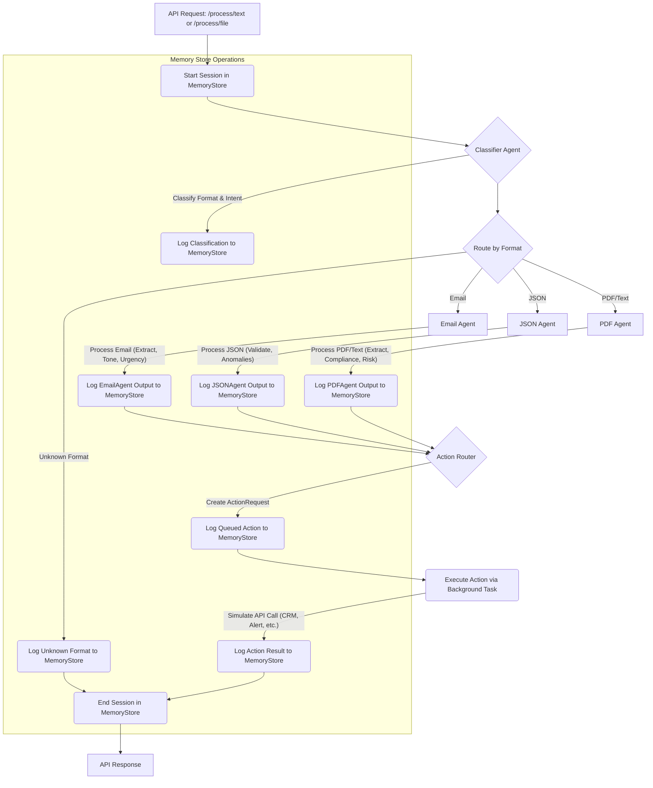

# Multi-Agent AI System

This project is an AI system that can understand and process different kinds of information—like emails, JSON data, and text from PDF documents. It figures out what the input is about and then decides on the next steps, such as flagging a risky transaction or escalating an urgent email.

## The Core Idea

I built this to explore how different specialized AI "agents" can work together. Each agent has a specific role:
*   **Classifier Agent:** Looks at the input and decides if it's an email, JSON, or PDF-like text, and figures out the main purpose (e.g., a complaint, an invoice, a fraud risk).
*   **Email Agent:** Handles emails – extracts details, checks the tone (is the customer angry?), and figures out urgency.
*   **JSON Agent:** Works with JSON data – checks if it's valid, looks for anything unusual or against business rules.
*   **PDF Agent:** Processes text from PDF documents – pulls out important information like invoice details or compliance keywords.
*   **Action Router:** Takes the findings from the other agents and decides what action to take next (e.g., "escalate to CRM," "block transaction").
*   **Memory Store:** Keeps a record of everything that happens in a SQLite database (`memory_store.db`).

## How It Works (A Quick Look)

1.  **Input:** The system gets information either as plain text or an uploaded file through its API.
2.  **Classify:** The `ClassifierAgent` figures out the format and intent.
3.  **Process:** The information is passed to the right specialized agent (Email, JSON, or PDF Agent) for detailed analysis.
4.  **Act:** The `ActionRouter` looks at the agent's findings and queues up a follow-up action (like simulating a call to a CRM or an alert system).
5.  **Log:** Every step, from input to action, is logged in the `MemoryStore`.

## Getting Started

### What You'll Need
*   Python 3.8 or newer

### Setup
1.  **Clone the project:**
    ```bash
    git clone <your-repo-url>
    cd multi-agent-ai-system
    ```
2.  **Install dependencies:**
    It's a good idea to use a virtual environment:
    ```bash
    python -m venv venv
    source venv/bin/activate  # On Windows: venv\Scripts\activate
    pip install -r requirements.txt
    ```
    (The `start_system.py` script also includes a basic check to install key packages if you miss this step.)

### Running the System
1.  **Start the server:**
    ```bash
    python start_system.py
    ```
    This will usually start the API server at `http://localhost:8000`. You'll see links to the API docs and status endpoint in your terminal.

## Testing It Out

*   **API Documentation:** Once the server is running, open `http://localhost:8000/docs` in your browser. You can use this interactive page to send requests.
*   **Sample Tests:** Run the included test script to process files from the `samples/` directory:
    ```bash
    python test_samples.py
    ```
    This script will hit the `/process/text` endpoint with the content of the sample files.

## Tech Stack

This project mainly uses:
*   **Python**
*   **FastAPI** (for building the web API)
*   **Uvicorn** (as the server for FastAPI)
*   **Pydantic** (for data validation in FastAPI)
*   **PyPDF2** (for extracting text from actual PDF files when they are uploaded)
*   **SQLite** (for the `MemoryStore` database)
*   **Requests** (used by the `ActionRouter` to simulate API calls)

*(Note: `requirements.txt` includes `langchain` and related packages, as these were part of the initial client suggestions. However, the current agent logic for classification, extraction, and routing is primarily rule-based and does not yet deeply integrate Langchain's capabilities.)*

## A Note on PDF Processing

The system handles PDF content in two main ways:
1.  **Actual `.pdf` files:** If you upload a `.pdf` file to the `/process/file` endpoint, the `PDFAgent` uses `PyPDF2` to extract text from it.
2.  **Text from PDFs:** If you send plain text (that might have been copied from a PDF, or is in a `.txt` file like those in `samples/pdfs/`) to the `/process/text` endpoint, the `ClassifierAgent` can identify it as PDF-like content, and the `PDFAgent` will process this text.

## Project Structure

*   `multi_agent_system/`: Contains all the core logic.
    *   `main.py`: The FastAPI application, API endpoints, and main processing orchestrator.
    *   `agents/`: Where the `ClassifierAgent`, `EmailAgent`, `JSONAgent`, and `PDFAgent` live.
    *   `memory/`: Code for the `MemoryStore` (SQLite interaction).
    *   `routers/`: The `ActionRouter` for deciding on and simulating follow-up actions.
*   `samples/`: Example input files (`.eml`, `.json`, `.txt` for PDF content).
*   `start_system.py`: Script to easily start the FastAPI server.
*   `test_samples.py`: Script to run tests using the sample files.
*   `memory_store.db`: The SQLite database file (this is in `.gitignore`).
*   `Agentic Workflow/Agentic workflow.png`: A diagram showing the system's flow. You can include this image directly in your GitHub README.

## Workflow Diagram

You can include the diagram from `Agentic Workflow/Agentic workflow.png` here.
Alternatively, you can use the Mermaid diagram code provided earlier to render it directly in Markdown environments that support it.



This should give a good, practical overview of your project!
